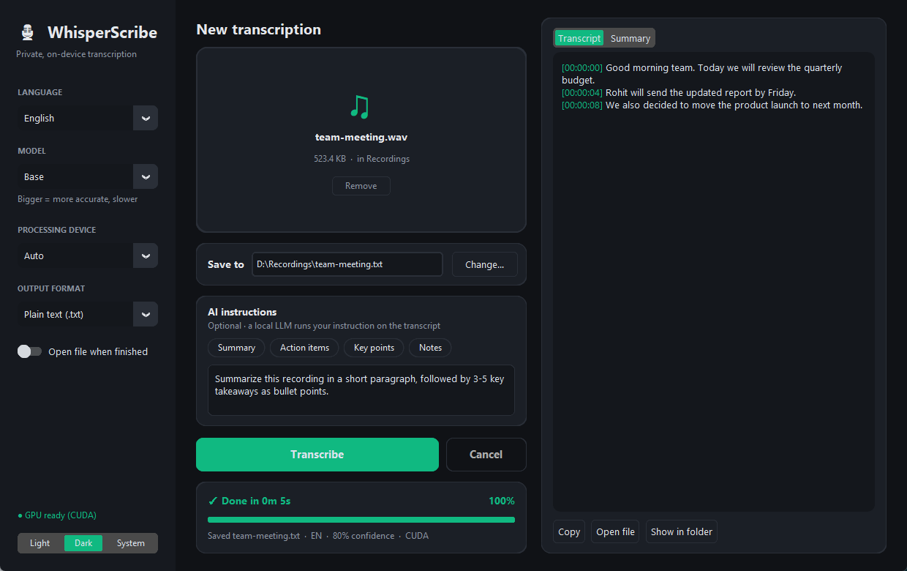

# 🎙 WhisperScribe

**Private, on-device transcription for Windows.** Drop in a recording and get back a transcript (plus an optional AI summary). All processing happens on your machine, and nothing is uploaded.



## Features

- **Drag & drop** an audio or video file anywhere in the window, or click to browse
- **Fast, accurate speech-to-text** with [faster-whisper](https://github.com/SYSTRAN/faster-whisper), using your NVIDIA GPU when one is available
- **Automatic CPU fallback** if CUDA isn't available
- **Live transcript** that streams in as each segment is recognised, with a progress bar and time-remaining estimate
- **English, Hindi, Hinglish** (code-switched), or auto-detect
- **Model choice** from Tiny (fastest) to Large v3 Turbo (most accurate)
- **Output formats:** plain text, timestamped text, or `.srt` subtitles
- **Optional local AI instructions:** summaries, action items, key points or meeting notes, generated by a small local LLM ([Qwen2.5-0.5B-Instruct](https://huggingface.co/Qwen/Qwen2.5-0.5B-Instruct)). Long recordings are summarized in chunks rather than truncated.
- Light/Dark/System themes, saved settings, and keyboard shortcuts

Supported inputs: MP3, M4A, WAV, FLAC, OGG, AAC, WMA, OPUS, WEBM, MP4, MKV, MOV, AVI.

## Installation

Requires **Python 3.10+** on Windows (it should also run on macOS/Linux, apart from the GPU DLL helper).

```bash
git clone https://github.com/<your-username>/WhisperScribe.git
cd WhisperScribe
python -m venv .venv
.venv\Scripts\activate
pip install -r requirements.txt
```

### GPU acceleration (optional)

- **Transcription:** `faster-whisper` needs the CUDA 12 cuBLAS/cuDNN libraries. The `nvidia-cublas-cu12` and `nvidia-cudnn-cu12` packages in `requirements.txt` provide them, and the app registers their DLL folders automatically.
- **AI summaries:** install a CUDA build of PyTorch from [pytorch.org](https://pytorch.org/get-started/locally/), e.g.
  `pip install torch --index-url https://download.pytorch.org/whl/cu130`

To check that your GPU works:

```bash
python test_gpu.py
```

## Usage

```bash
python local_transcriber_app.py
```

(Use `pythonw local_transcriber_app.py` to launch without a console window.)

1. Drop a recording onto the window.
2. Pick the language, model and output format in the sidebar.
3. *(Optional)* choose an AI instruction chip or write your own.
4. Press **Transcribe**. The result is saved next to the audio file by default; click **Change…** to save it somewhere else.

| Shortcut | Action |
| --- | --- |
| `Ctrl+O` | Open a file |
| `Ctrl+Enter` | Start transcribing |
| `Esc` | Cancel |

Models are downloaded from Hugging Face on first use and cached, so the first run of each model is slower.

## Project structure

```
local_transcriber_app.py   # CustomTkinter UI (drag & drop, settings, live progress)
engine.py                  # Transcription, summarization and output formats (no UI code)
test_gpu.py                # Quick CUDA sanity check
icon.ico                   # App icon
```

Logs are written to `logs/whisperscribe.log` (rotated automatically). Settings are stored in `%APPDATA%\WhisperScribe\settings.json`.

## Troubleshooting

| Problem | Fix |
| --- | --- |
| `cublas64_12.dll is not found` | `pip install nvidia-cublas-cu12 nvidia-cudnn-cu12`, or set *Processing device* to **CPU** |
| Drag & drop doesn't work | `pip install tkinterdnd2` (clicking to browse always works) |
| Summary quality is poor | The bundled 0.5B model is tiny. Swap `SUMMARY_MODEL` in `engine.py` for a larger model, e.g. `Qwen/Qwen2.5-1.5B-Instruct` |

## License

[MIT](LICENSE)
