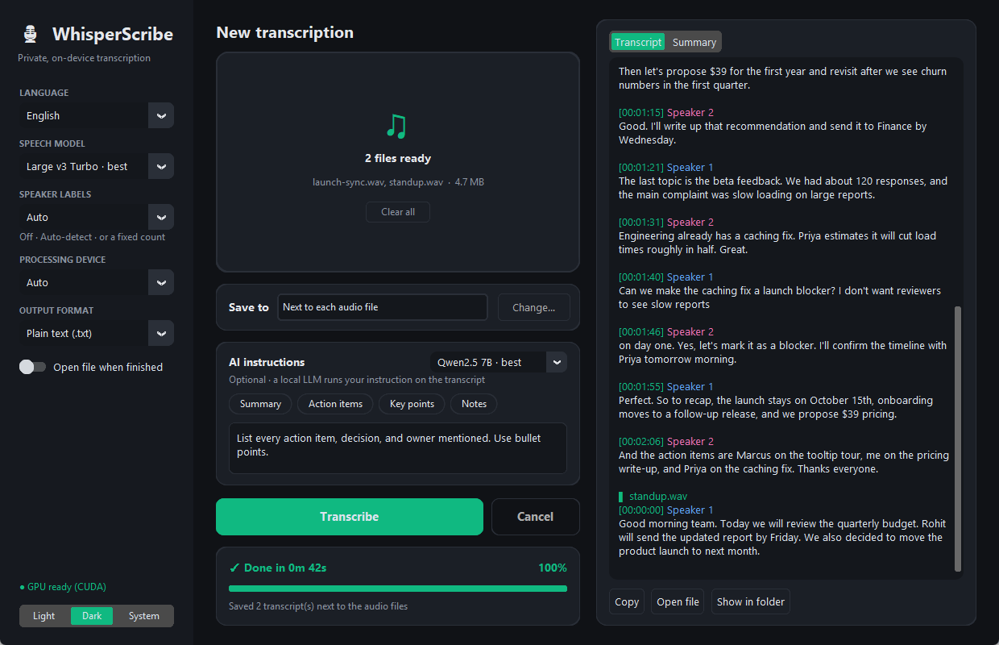
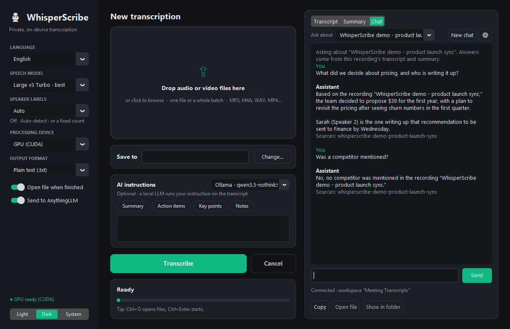

# 🎙 WhisperScribe

[](https://github.com/rohitk9/WhisperScribe/actions/workflows/tests.yml)

**Private, on-device transcription for Windows.** Drop in recordings and get back transcripts with speaker labels and
AI summaries. All processing happens on your machine, and nothing is uploaded.


## Features

- **Drag & drop** one file, many files or a whole folder anywhere in the window; results are saved next to each file
- **Accurate, fast speech-to-text** with [faster-whisper](https://github.com/SYSTRAN/faster-whisper) Large v3 Turbo: a
  57-minute recording takes about a minute on an RTX 5080
- **Speaker labels:** "Speaker 1 / Speaker 2", with the number of speakers detected automatically or set by you
- **AI instructions** run by a local LLM (default: Qwen2.5 7B in 4-bit). One-click presets for summary, action items,
  key points and meeting notes, or write your own. Long recordings are summarized in parts, not truncated.
- **Chat with your recordings** through [AnythingLLM](https://anythingllm.com/) running locally: ask about one
  recording or across all of them, with sources ([setup](#chat-with-your-recordings-anythingllm))
- **Live transcript** with progress and time remaining; automatic CPU fallback if the GPU isn't usable
- English, Hindi, Hinglish (code-switched) or auto-detect · plain text, timestamped text or `.srt` subtitles
- Light/Dark/System themes, saved settings and keyboard shortcuts



## Chat with your recordings (AnythingLLM)



WhisperScribe can send every transcript, with its summary and speaker labels, to
[AnythingLLM Desktop](https://anythingllm.com/) on the same machine. Nothing leaves your computer. Transcripts go
into a **Meeting Transcripts** workspace with one thread per recording, so you can chat in WhisperScribe's
**Chat** tab or carry on the same conversation inside AnythingLLM.

1. In AnythingLLM, open **Settings → Developer API → Generate New API Key**.
2. In WhisperScribe, open the **Chat** tab, click **⚙**, paste the key, then **Test** and **Save**. The key is
   stored in Windows Credential Manager.
3. Keep **Send to AnythingLLM** switched on in the sidebar and transcribe as usual.
4. Ask questions. Pick one recording in **Ask about**, or **All meetings** to search across everything.

If Ollama (AnythingLLM's built-in engine, or standalone Ollama) has `qwen3.5:9b` installed, WhisperScribe creates
a no-thinking variant, `qwen3.5-nothink:9b`, and uses it for the transcripts workspace and for summaries. Your other
AnythingLLM workspaces keep their own model. To install the model: `ollama pull qwen3.5:9b`.

## Why these models?

I benchmarked 9 speech models and 7 local LLMs on an RTX 5080 / Ryzen 7 9800X3D. Full results are in
[docs/BENCHMARKS.md](docs/BENCHMARKS.md).

| | Old default | New default |
| --- | --- | --- |
| Speech | Base: 78 % confidence, 2.2 % WER | **Large v3 Turbo: 87 % confidence, 0.3 % WER, same speed** |
| Summary | Qwen2.5 0.5B: found 50 % of key facts | **Qwen2.5 7B (4-bit): found 100 %, about 6 s** |
| Chat (via Ollama) | phi4: 5/10 on long meetings, invented facts | **qwen3.5 9B: 10/10, answers in about 5 s** |

## Download (Windows, NVIDIA GPU)

Get the latest `WhisperScribe-*-win64.7z.*` files from [Releases](https://github.com/rohitk9/WhisperScribe/releases).
Download every part into one folder, open the `.7z.001` file with [7-Zip](https://www.7-zip.org/) and extract it, then
run `WhisperScribe\WhisperScribe.exe`. The bundle includes the CUDA libraries, so the download is several GB. Models
are downloaded on first use: about 1.6 GB for speech and about 5 GB for the 7B summarizer.

## Run from source

Requires **Python 3.10+** on Windows (macOS/Linux should work, apart from the GPU DLL helper).

```bash
git clone https://github.com/rohitk9/WhisperScribe.git
cd WhisperScribe
python -m venv .venv
.venv\Scripts\activate
pip install torch --index-url https://download.pytorch.org/whl/cu130   # CUDA build of PyTorch
pip install -r requirements.txt
python local_transcriber_app.py        # or: pythonw local_transcriber_app.py (no console window)
```

Check that your GPU is visible with `python test_gpu.py`. Without an NVIDIA GPU everything runs on the CPU, and the
summarizer switches to Qwen3 1.7B automatically.

## Usage

1. Drop recordings onto the window, or click the drop zone to browse.
2. Pick the language, speech model, speaker labels and output format in the sidebar.
3. *(Optional)* pick an AI instruction preset, or type your own, and choose the summary model.
4. Press **Transcribe**. Each result is saved next to its audio file; for a single file, **Change…** picks another
   location.

| Shortcut | Action |
| --- | --- |
| `Ctrl+O` | Open files |
| `Ctrl+Enter` | Start |
| `Esc` | Cancel |

## Development

```bash
pip install -r requirements-dev.txt
python -m pytest -q tests                  # fast unit tests, no GPU or models needed (also run in CI)
python benchmarks/bench_whisper.py --help  # re-run the model comparisons on your hardware
python packaging/build.py v2.0.0           # build dist/WhisperScribe/ and split release archives (needs 7-Zip)
dist\WhisperScribe\WhisperScribe.exe --selftest some.wav   # headless check of a build; result in logs/
```

```
local_transcriber_app.py   # CustomTkinter UI: drag & drop, batch queue, settings, live progress
engine.py                  # transcription, speaker labels, summarization, output formats (no UI code)
integrations.py            # Ollama + AnythingLLM HTTP clients (standard library only)
chat_panel.py              # Chat tab and AnythingLLM connection dialog
ui_theme.py                # shared colours
tests/                     # pytest unit tests for engine.py
benchmarks/                # speech-model and LLM comparison scripts
packaging/                 # PyInstaller spec and release build script
.github/workflows/         # CI: tests on Windows + Linux
```

Logs are written to `logs/whisperscribe.log` (rotated automatically). Settings are stored in
`%APPDATA%\WhisperScribe\settings.json`.

## Troubleshooting

| Problem | Fix |
| --- | --- |
| `cublas64_12.dll is not found` | `pip install nvidia-cublas-cu12 nvidia-cudnn-cu12`, or set *Processing device* to **CPU** |
| Drag & drop doesn't work | `pip install tkinterdnd2` (clicking to browse always works) |
| Summary is slow or runs out of memory | Pick **Qwen3 1.7B · fast** next to *AI instructions* |
| Speaker count is wrong | Set *Speaker labels* to the exact number instead of *Auto* |
| Chat says "Not connected" or HTTP 403 | Check that AnythingLLM is running, then re-enter the API key under **Chat → ⚙** |
| First chat answer takes ~40 s | Ollama is loading the model into VRAM; later answers take a few seconds |

## License

[MIT](LICENSE)
